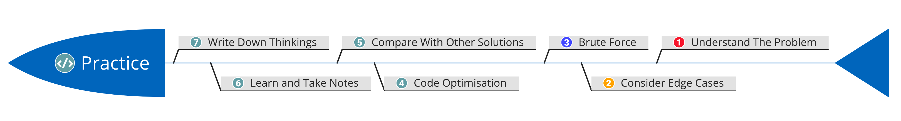

# HackerRank Interview Kit
### About
This is a repo that contains Python 3 solutions to all problems in the [HackerRank Interview Kit](https://www.hackerrank.com/interview/interview-preparation-kit).

### Summary Table
|           Subject          | Easy | Medium | Hard | Total | Interview Chance  |
|:--------------------------:|:----:|:------:|:----:|:-----:|:-----------------:|
|           Arrays           |   2  |    2   |   1  |   5   |        70%        |
|  Dictionaries and Hashmaps |   2  |    3   |   0  |   5   |        40%        |
|           Sorting          |   2  |    2   |   1  |   5   |        40%        |
|     String Manipulation    |   2  |    3   |   0  |   5   |        40%        |
|      Greedy Algorithms     |   2  |    2   |   1  |   5   |        31%        |
|           Search           |   0  |    5   |   2  |   7   |        30%        |
|     Dynamic Programming    |   0  |    3   |   1  |   4   |        27%        |
|      Stacks and Queues     |   0  |    5   |   1  |   6   |        17%        |
|           Graphs           |   0  |    2   |   3  |   5   |        15%        |
|            Trees           |   2  |    2   |   1  |   5   |        12%        |
|        Linked Lists        |   5  |    0   |   0  |   5   |         8%        |
| Recursion and Backtracking |   1  |    3   |   0  |   4   |         5%        |
|        Miscellaneous       |   1  |    3   |   0  |   4   |        ...        |
|           Total            |  19  |    35  |  11  |   65  |        ...        |

### Path
1. Read and understand the problem.
2. Consider edge cases in the problem.
3. Write brute force (dummy) code to solve the problem.
4. Try to optimise the code based on experience.
5. Look at other solutions and find better solutions.
6. Learn from other solutions and take notes down.
7. Write down solution and thinkings in simple words.

### Data Structures and Algorithms Mind Map (in Chinese)

